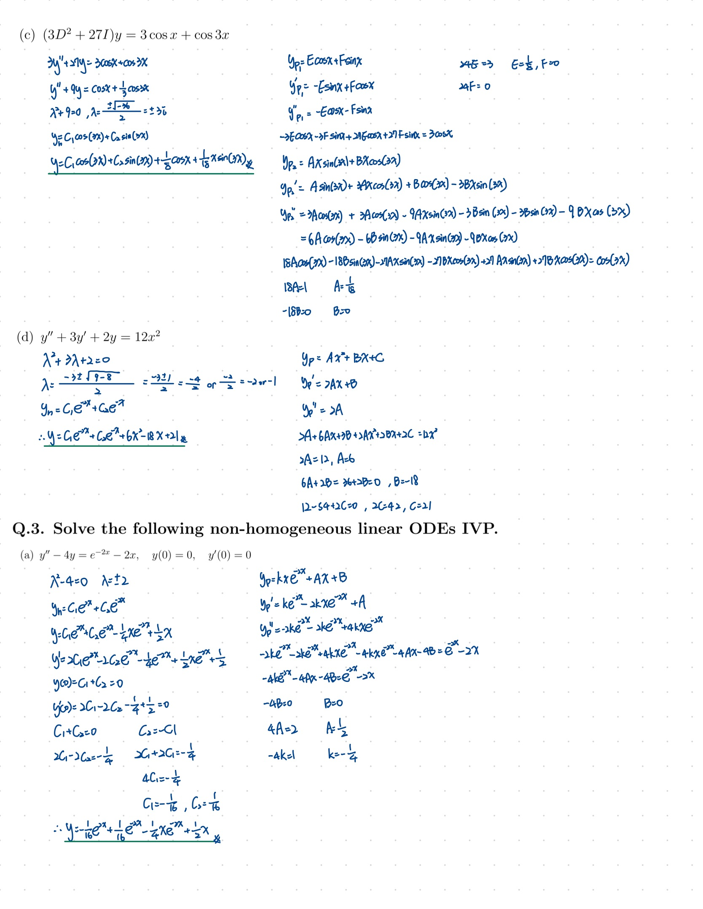
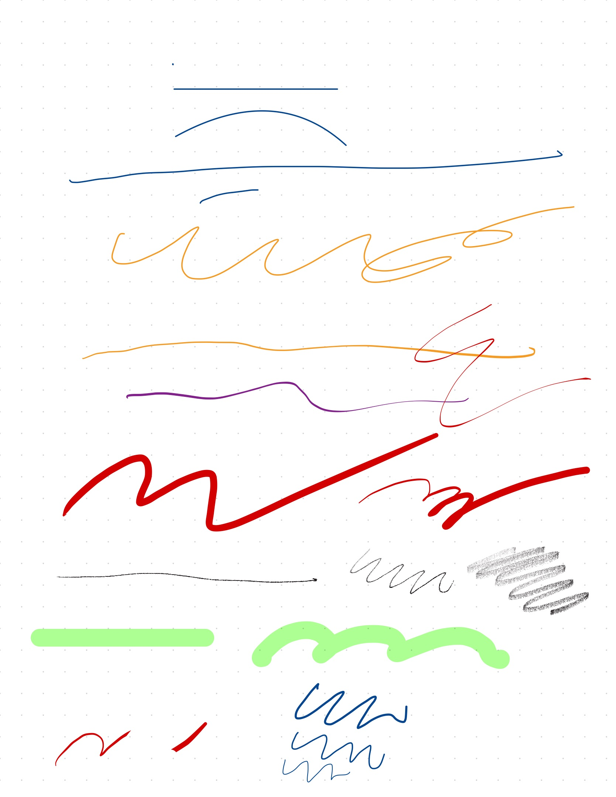
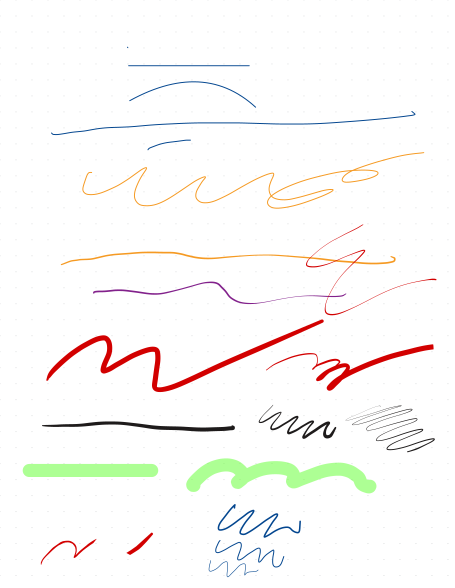
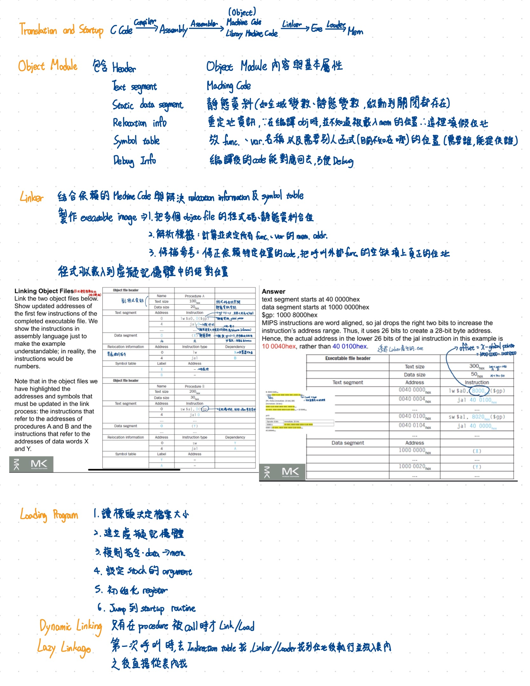

<a id="english"></a>

# Document Parser for GoodNotes
[中文](#中文)

> [!WARNING]
> **Vibe Coding Disclaimer**: This entire project was developed through **Vibe Coding** (AI-assisted rapid pair-programming and exploratory development). While the parser has been verified against test corpora, code and architecture choices reflect an experimental AI-driven iteration style. Use at your own discretion!

[](https://kaih1825.github.io/parser-for-goodnotes/)
[](https://github.com/Kaih1825/document-parser-for-goodnotes/actions/workflows/pages.yml)


> [!TIP]
> ### 🌐 Interactive Web Demo (Zero Installation Required)
> **Try the parser and vector SVG renderer directly in your browser:**  
> 👉 **[https://kaih1825.github.io/parser-for-goodnotes/](https://kaih1825.github.io/parser-for-goodnotes/)**
>
> *⚡ 100% Client-Side WebAssembly (Pyodide) — Instant vector preview, multi-page inspection & downloads with complete local privacy.*

An independent, open-source, fully typed Python toolkit for inspecting and parsing user-supplied GoodNotes 5 and 6 `.goodnotes` archives. It decodes protobuf **wire format** directly, parses Apple LZ4 framed streams, decodes Troy Hanson TPL memory images, extracts observed RGBA stroke data, and exports documents to JSON and SVG.

**This project is not affiliated with, endorsed by, sponsored by, or officially connected to Goodnotes Limited.** See [`LEGAL-NOTICE.md`](LEGAL-NOTICE.md) for release and usage notes.

It **deliberately does NOT use heuristic float scanning**.

## 🖼️ Rendering Comparison

| Source Archive | GoodNotes Original (`.jpg`) | This Project SVG Export (`.svg`) |
| :---: | :---: | :---: |
| **Example 1**<br>([`ex1.goodnotes`](assets/ex1.goodnotes)) |  |  |
| **Example 2**<br>([`ex2.goodnotes`](assets/ex2.goodnotes)) |  |  |
| **Example 3**<br>([`ex3.goodnotes`](assets/ex3.goodnotes)) |  |  |

## Features

- **Protobuf Wire Decoder**: Lossless parsing of framed and unframed protobuf messages, preserving unknown fields.
- **Apple LZ4 & Troy Hanson TPL Decoder**: Decompresses `bv41` LZ4 streams and decodes embedded TPL format strings (`vuA(v)A(S(uu))...`) into structured stroke points and variable-width ribbons.
- **Stroke & Color Parsing**: Direct protobuf trailer decoding after `bv4$` to extract exact RGBA colors and highlighter transparency.
- **Stroke Support**: Parses a growing set of dots, lines, curves, pen tools, highlighters, erasers, shapes, and moved/copied elements observed in the test corpus.
- **Page & Background Resolution**: Automatic PDF background `/MediaBox` dimension detection (A4, Letter, landscape vs. portrait), page ordering, text fragments, and sticky notes (便條紙) content extraction.
- **CLI Tools**: `gn-inspect`, `gn-dump`, `gn-diff`, `gn-export-json`, `gn-export-svg`, `gn-export-pdf`.

### Feature Support Status

#### ✅ Working / Fully Supported
- **Fountain Pen, Ballpoint Pen, Brush Pen, Highlighter**: Full support with custom colors and line thicknesses.
- **Text**: Typed text fragments.
- **Sticky Notes**: Sticky note contents and formatting.
- **Images**: Embedded images.
- **Auto-Shapes & Shapes**: Vector shape rendering.
- **Eraser**: Eraser strokes and line cuts.
- **Lasso Tool**: Transformed, copied, or moved elements.
- **PDF-backed Notebooks**: PDF background pages with dimensions (`/MediaBox`).

#### ⚠️ Known Issues / In Progress
- **Pencil**: Visible output, but pressure sensitivity is incorrect and tilt sensitivity is missing.
- **Arrows**: Render output is currently highly unstable.
- **Stickers / Elements**: Certain vector lines/strokes may fail to export.
- **Audio Recordings**: Not yet implemented.


## Installation & Setup

Using [`uv`](https://github.com/astral-sh/uv):

```sh
uv sync
```

Or standard pip install:

```sh
pip install -e .
```

Run the unit test suite with:

```sh
uv run pytest
```

> **Note:** `samples/` is intentionally ignored and is not part of the public source tree. Do not publish `.goodnotes` files or extracted assets unless you have permission to redistribute them.

## CLI Usage

```sh
# Inspect archive inventory and sha256 checksums
gn-inspect sample.goodnotes

# Lossless dump of any protobuf member to JSON
gn-dump sample.goodnotes index.notes.pb

# Diff two .goodnotes archives
gn-diff before.goodnotes after.goodnotes

# Export entire document, metadata, pages, strokes, and raw wire trees to JSON
gn-export-json sample.goodnotes -o document.json

# Export vector SVG pages with exact stroke ribbons, colors, and dimensions
gn-export-svg sample.goodnotes -o pages-svg

# Export vector SVGs and package all pages into a PDF
gn-export-svg sample.goodnotes -o pages-svg --pdf

# Directly export multi-page PDF document
gn-export-pdf sample.goodnotes -o document.pdf
```

Or via module invocation:

```sh
PYTHONPATH=src python3 -m goodnotes_re.cli export-svg sample.goodnotes -o pages-svg
```

For the full CLI reference (including all flags and batch export examples), see [`cli.md`](cli.md) (Traditional Chinese).

## Python Library API

```python
from goodnotes_re import GoodNotesDocument

with GoodNotesDocument.open("sample.goodnotes") as doc:
    # Inventory
    members = doc.inventory()
    
    # Document pages with strokes, dimensions, and text
    pages = doc.pages()
    for page in pages:
        print(f"Page {page.index + 1}: {page.dimensions.width}x{page.dimensions.height} pt")
        print(f"Strokes: {len(page.strokes)}")
        for stroke in page.strokes:
            print(f"  Stroke {stroke.uuid}: color {stroke.color_hex}, alpha {stroke.alpha}, points {len(stroke.points)}")
    
    # Text and Sticky Notes content
    fragments = doc.text_fragments()
    for frag in fragments:
        print(f"[{frag.source_path}] {frag.format}: {frag.text}")

    # Structural page-element summaries for format analysis
    for page in pages:
        for element in page.elements:
            print(element.kind, element.uuid, element.attachment_uuid, element.related_uuids)
```

## Documentation

| Document | Description |
|---|---|
| [`wiki/09-current-re-findings.md`](wiki/09-current-re-findings.md) | Format analysis findings and field annotations |
| [`wiki/08-testing-building-publishing.md#3-controlled-corpus-protocol`](wiki/08-testing-building-publishing.md#3-controlled-corpus-protocol) | Protocol for adding new wire-format observations |
| [`cli.md`](cli.md) | Full CLI reference (Traditional Chinese) |
| [`wiki/`](wiki/) | Deep-dive technical documentation (architecture, formats, rendering) |
| [`LEGAL-NOTICE.md`](LEGAL-NOTICE.md) | Legal, trademark, privacy, and redistribution notice |

See also the [Contributing Guide](CONTRIBUTING.md).

> [!IMPORTANT]
> **Legal & Trademark Notice**: "Goodnotes" and related names, logos, and marks are the property of Goodnotes Limited. Document Parser for GoodNotes is an independent, community-developed project and is **not affiliated with, endorsed by, sponsored by, or officially connected to Goodnotes Limited**. For full legal, trademark, privacy, and redistribution details, please read [`LEGAL-NOTICE.md`](LEGAL-NOTICE.md).

---


<a id="中文"></a>

# Document Parser for GoodNotes
[English](#english)

> [!WARNING]
> **Vibe Coding 免責聲明**：本專案完全採用 **Vibe Coding**（AI 輔助快速結對程式設計與探索式開發）進行構建。雖然解析器已通過測試樣本驗證，但程式碼結構與架構選擇體現了 AI 驅動的實驗性疊代風格。請自行評估並謹慎使用！

[](https://kaih1825.github.io/parser-for-goodnotes/)
[](https://github.com/Kaih1825/document-parser-for-goodnotes/actions/workflows/pages.yml)


> [!TIP]
> ### 🌐 瀏覽器線上互動式 Demo（免安裝）
> **無需安裝 Python 環境，直接在瀏覽器解析並預覽向量 SVG：**  
> 👉 **[https://kaih1825.github.io/parser-for-goodnotes/](https://kaih1825.github.io/parser-for-goodnotes/)**
>
> *⚡ 100% 瀏覽器本地 WebAssembly (Pyodide) 運算 — 支援檔案拖放、即時預覽、分頁切換與向量 SVG / JSON 匯出，筆記完全不外流。*

一套獨立、開源且完整型別化的 Python 工具組，用於檢視與解析使用者提供的 GoodNotes 5 與 GoodNotes 6 `.goodnotes` 封存檔。它可直接解碼 protobuf **wire format**、解析 Apple LZ4 框架串流、解碼 Troy Hanson TPL 記憶體映像、擷取觀察到的 RGBA 筆跡資料，並將文件匯出為 JSON 與 SVG。

**本專案與 Goodnotes Limited 沒有任何關聯、背書、贊助或官方合作關係。** 發布與使用注意事項請參閱 [`LEGAL-NOTICE.md`](LEGAL-NOTICE.md)。

本專案**刻意不使用啟發式浮點數掃描**。

## 🖼️ 渲染效果對比

| 原始封存檔 | GoodNotes 原版渲染 (`.jpg`) | 本專案 SVG 匯出 (`.svg`) |
| :---: | :---: | :---: |
| **範例 1**<br>([`ex1.goodnotes`](assets/ex1.goodnotes)) |  |  |
| **範例 2**<br>([`ex2.goodnotes`](assets/ex2.goodnotes)) |  |  |
| **範例 3**<br>([`ex3.goodnotes`](assets/ex3.goodnotes)) |  |  |

## 功能

- **Protobuf Wire Decoder**：無損解析有框架與無框架的 protobuf 訊息，並保留未知欄位。
- **Apple LZ4 與 Troy Hanson TPL Decoder**：解壓縮 `bv41` LZ4 串流，並將嵌入的 TPL 格式字串解碼為結構化筆跡點與可變寬度筆跡帶。
- **筆跡與色彩解析**：解析 `bv4$` 後的 protobuf trailer，以擷取精確 RGBA 顏色與螢光筆透明度。
- **筆跡與幾何元件支援**：解析測試樣本中觀察到的單點、直線、曲線、鋼筆/原子筆工具、螢光筆、橡皮擦切口、圖形及移動/複製元素。
- **頁面與背景解析**：自動偵測 PDF `/MediaBox` 尺寸（A4、Letter、橫向與直向）、頁面順序、文字片段與便條紙內容。
- **CLI 工具**：`gn-inspect`、`gn-dump`、`gn-diff`、`gn-export-json`、`gn-export-svg`、`gn-export-pdf`。

### 功能支援狀態

#### ✅ 目前測試可正常輸出
- **鋼筆、原子筆、畫筆、螢光筆**：可處理不同顏色及粗細。
- **文字**：打字文字內容。
- **便利貼**：便條紙內容。
- **圖片**：內嵌圖片。
- **自動形狀、形狀**：幾何圖形。
- **橡皮擦**：橡皮擦筆跡與切口。
- **套索工具**：選取、移動與變形的元素。
- **有 PDF 的筆記本**：PDF 背景與頁面尺寸。

#### ⚠️ 目前已知有問題 / 開發中
- **鉛筆**：可顯示，但壓感有問題，以及沒有傾斜感知。
- **箭頭**：目前輸出極度不穩定。
- **素材（貼紙）**：可能有部分線條無法輸出。
- **錄音**：還沒實作。


## 安裝與設定

使用 [`uv`](https://github.com/astral-sh/uv)：

```sh
uv sync
```

或使用標準 pip：

```sh
pip install -e .
```

執行測試：

```sh
uv run pytest
```

> **注意：** `samples/` 刻意被忽略，且不屬於公開原始碼樹。除非您擁有重新發布的權限，否則請勿發布 `.goodnotes` 檔案或擷取出的資產。

## CLI 使用方式

```sh
# 檢視封存檔目錄清單與 sha256 校驗碼
gn-inspect sample.goodnotes

# 無損印出任何 protobuf 成員至 JSON
gn-dump sample.goodnotes index.notes.pb

# 比對兩個 .goodnotes 封存檔差異
gn-diff before.goodnotes after.goodnotes

# 匯出整份文件、元資料、頁面、筆跡與原始 wire 樹狀圖至 JSON
gn-export-json sample.goodnotes -o document.json

# 匯出包含精確筆跡緞帶、顏色與尺寸的向量 SVG 頁面
gn-export-svg sample.goodnotes -o pages-svg

# 匯出向量 SVG 並同步按頁面順序打包為 PDF
gn-export-svg sample.goodnotes -o pages-svg --pdf

# 直接將整份筆記匯出為多頁 PDF 文件
gn-export-pdf sample.goodnotes -o document.pdf
```

完整 CLI 參考請參閱 [`cli.md`](cli.md)。

## Python 函式庫 API

```python
from goodnotes_re import GoodNotesDocument

with GoodNotesDocument.open("sample.goodnotes") as doc:
    # 目錄清單
    members = doc.inventory()
    
    # 包含筆跡、尺寸與文字的文件頁面
    pages = doc.pages()
    for page in pages:
        print(f"Page {page.index + 1}: {page.dimensions.width}x{page.dimensions.height} pt")
        print(f"筆跡數量: {len(page.strokes)}")
        for stroke in page.strokes:
            print(f"  Stroke {stroke.uuid}: color {stroke.color_hex}, alpha {stroke.alpha}, points {len(stroke.points)}")
    
    # 打字文字與便條紙內容
    fragments = doc.text_fragments()
    for frag in fragments:
        print(f"[{frag.source_path}] {frag.format}: {frag.text}")

    # 用於格式分析的結構化頁面元素摘要
    for page in pages:
        for element in page.elements:
            print(element.kind, element.uuid, element.attachment_uuid, element.related_uuids)
```

## 文件

| 文件 | 說明 |
|---|---|
| [`wiki/09-current-re-findings.md`](wiki/09-current-re-findings.md) | 格式分析發現與欄位註解 |
| [`wiki/08-testing-building-publishing.md#3-受控格式分析實驗協議-controlled-corpus-protocol`](wiki/08-testing-building-publishing.md#3-受控格式分析實驗協議-controlled-corpus-protocol) | 新增 wire-format 觀察結果的流程 |
| [`cli.md`](cli.md) | 完整 CLI 參考（繁體中文） |
| [`wiki/`](wiki/) | 深入技術文件（架構、格式、渲染原理） |
| [`LEGAL-NOTICE.md`](LEGAL-NOTICE.md) | 法律、商標、隱私與重新發布注意事項 |

另請參閱 [貢獻指南](CONTRIBUTING.md)。

> [!IMPORTANT]
> **法律與商標聲明**：「Goodnotes」及相關名稱、標誌與標誌均為 Goodnotes Limited 所有。Document Parser for GoodNotes 是一套獨立且由社群開發的開源專案，**與 Goodnotes Limited 沒有任何附屬、背書、贊助或官方合作關係**。完整法律、商標、隱私及重新發布注意事項，請參閱 [`LEGAL-NOTICE.md`](LEGAL-NOTICE.md)。


