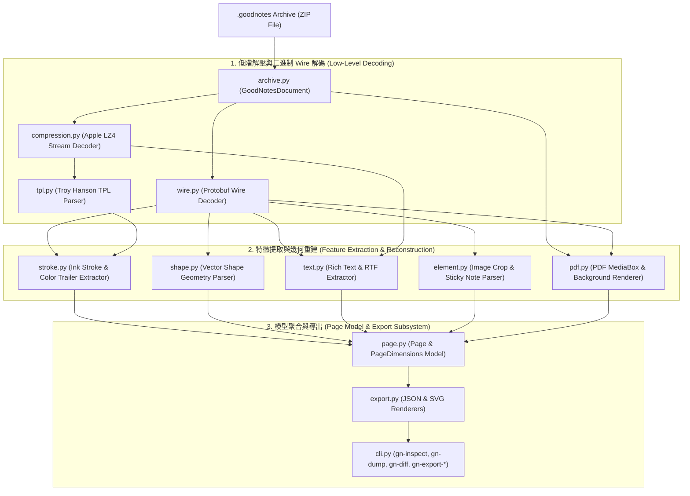

# 01 - 系統架構與資料流 (Architecture Overview)

本章節介紹 **GoodNotes Reverse Engineering Toolkit** 的整體系統設計、內部模組劃分、數據處理管道 (Data Pipeline)，以及 GoodNotes 5 與 GoodNotes 6 檔案格式的演進關聯。

---

## 系統整體架構 (System Architecture)

本工具包採層次化、模組化架構設計。低層專注於無模式 (Schema-free) 的解壓與位元組串流解碼，中層進行特徵提取與幾何重建，高層則提供 JSON 與 SVG 向量繪製與 CLI 介面。



---

## 核心模組職責對照表 (Module Breakdown)

專案源碼位於 [`src/goodnotes_re/`](../src/goodnotes_re/)，各模組職責劃分如下：

| 模組名稱 | 絕對路徑 / Clickable Link | 核心職責與功能 |
| :--- | :--- | :--- |
| **`wire.py`** | [`src/goodnotes_re/wire.py`](../src/goodnotes_re/wire.py) | **Protobuf Wire 解碼器**。實現 7-bit Varint 讀取、WireType 判定、Length-Delimited 解碼與串流分幀 (`decode_delimited_messages`)。不需 `.proto` 即可保持完整位元組結構。 |
| **`archive.py`** | [`src/goodnotes_re/archive.py`](../src/goodnotes_re/archive.py) | **ZIP 檔案封裝管理**。提供 `GoodNotesDocument` 類別，負責讀取內部成員檔（如 `index.notes.pb`, `notes/<UUID>`）、生成 Inventory 清單與計算 SHA256。 |
| **`compression.py`** | [`src/goodnotes_re/compression.py`](../src/goodnotes_re/compression.py) | **Apple Framed LZ4 解壓縮**。解碼以 `bv41`/`bv4-` 為標頭、`bv4$` 為結尾的 Apple 專有 LZ4 串流，維護 64KB 歷史視窗。 |
| **`tpl.py`** | [`src/goodnotes_re/tpl.py`](../src/goodnotes_re/tpl.py) | **Troy Hanson TPL 記憶體映像解析**。解析 C 語言 TPL 庫寫出的二進制點陣與字串格式描述符（ Format Strings，如 `vuA(v)...`）。 |
| **`stroke.py`** | [`src/goodnotes_re/stroke.py`](../src/goodnotes_re/stroke.py) | **筆跡與顏色解析**。結合 TPL 控制點提取壓感、計算平滑法向量；並解析 `bv4$` 後方的 Protobuf Trailer 提取 RGBA 顏色與 Lasso 移動偏移量 `(dx, dy)`；處理 v9 橡皮擦切口。 |
| **`shape.py`** | [`src/goodnotes_re/shape.py`](../src/goodnotes_re/shape.py) | **向量圖形解析**。從 Protobuf Record（Tag 9, 21, 22 等）解析矩形、橢圓、多邊形、虛線模式 (`dash_pattern`) 與箭頭樣式。 |
| **`text.py`** | [`src/goodnotes_re/text.py`](../src/goodnotes_re/text.py) | **富文本與 RTF 解析**。解碼 Type 35 / bv41 打字機文字框的字型、字號、顏色、對齊方式、列表樣式，以及舊版 RTF Payload。 |
| **`element.py`** | [`src/goodnotes_re/element.py`](../src/goodnotes_re/element.py) | **頁面元素特徵抽象**。解析圖片貼圖（包含邊界框、裁切 Crop 參數與旋轉角度）、便條紙 (Sticky Notes) 狀態（展開/折疊）與記錄墓碑 (Tombstone)。 |
| **`page.py`** | [`src/goodnotes_re/page.py`](../src/goodnotes_re/page.py) | **頁面模型 (Page Model)**。結合 PDF `/MediaBox` 尺寸解析（132 DPI 到 72 DPI 轉換），聚合單頁中的筆跡、圖形、文字、圖片與背景。 |
| **`pdf.py`** | [`src/goodnotes_re/pdf.py`](../src/goodnotes_re/pdf.py) | **PDF 背景繪製**。利用 PyMuPDF (fitz) 將 `.goodnotes` 內嵌的 PDF 附件頁面渲染為向量 SVG path 或圖像背景。 |
| **`export.py`** | [`src/goodnotes_re/export.py`](../src/goodnotes_re/export.py) | **匯出器 (JSON & SVG)**。將頁面模型轉換為完整 JSON 結構或高忠實度 SVG 向量圖。 |
| **`cli.py`** | [`src/goodnotes_re/cli.py`](../src/goodnotes_re/cli.py) | **命令行工具集**。提供 `gn-inspect`、`gn-dump`、`gn-diff`、`gn-export-json` 與 `gn-export-svg` 進入點。 |

---

## 解析管道與資料流 (Data Pipeline Flow)

當調用 `gn-export-svg sample.goodnotes -o output_dir` 時，資料的流動過程如下：

```
[sample.goodnotes (ZIP Archive)]
       │
       ▼
1. GoodNotesDocument.open() 
   └─ 解開 ZIP 檔案目錄清單 (Inventory)
       │
       ▼
2. GoodNotesDocument.pages()
   ├─ 1. 讀取 index.notes.pb 獲取頁面 UUID 順序 (`notes/<UUID>`)
   ├─ 2. 讀取 index.attachments.pb / index.events.pb 綁定背景 PDF
   └─ 3. 對每一個 `notes/<UUID>` 成員調用 decode_records()
       │
       ▼
3. Record 逐筆解析 (parse_page_from_records)
   ├─ 偵測 Tag 含有 "bv41" 關鍵字 ──► decode_apple_lz4() 解壓 ──► decode_tpl() 解點陣
   │                                                             │
   │                                                             ▼
   │                                             parse_stroke_field() 提取點、壓感、RGBA Color
   ├─ 偵測 Tag 9 / Tag 21 / Tag 22 ────────────────────────────► parse_shape_record() 構建圖形
   ├─ 偵測 Tag 16 == 35 或 Rich Text ──────────────────────────► parse_text_elements() 提取文字
   └─ 偵測 Tag 4 Attachment ──────────────────────────────────► parse_image_elements() 提取圖片與 Crop
       │
       ▼
4. 建立 Page 實體 (含 PageDimensions: PDF MediaBox Scaling 72/132)
       │
       ▼
5. write_svg() (export.py)
   └─ 按圖層 (PDF Background -> Sticky Note Cards -> Shapes -> Strokes -> Images -> Text) 產生 SVG
```

---

## GoodNotes 5 與 GoodNotes 6 格式比較 (GN5 vs GN6 Evolution)

GoodNotes 5 (GN5) 與 GoodNotes 6 (GN6) 在底層儲存結構上保持高度相容，皆使用 ZIP + Length-Delimited Protobuf + Apple LZ4 + TPL 結構。主要差異如下表：

| 評估項目 | GoodNotes 5 (GN5) | GoodNotes 6 (GN6) | 本工具包相容機制 |
| :--- | :--- | :--- | :--- |
| **檔案副檔名** | `.goodnotes` | `.goodnotes` | 均為標準 ZIP 格式，使用 `zipfile` 讀取。 |
| **Protobuf Record Framing** | Varint 前綴分幀 (Length-delimited records) | Varint 前綴分幀 或 Tag 7 包裹的內嵌 Record | `decode_records()` 會自動檢測是直接分幀或是包裹在 Tag 7 內。 |
| **筆跡座標格式** | TPL 經典 4 元組 (`uuuu`) / 11 元組 (`uuuuuuuuuuu`) | 增加動態高密度 6-float/3-float/5-float 格式 | `extract_points_from_tpl()` 內建多重 Format 匹配機制。 |
| **圖形與箭頭** | Tag 9 基本手繪圖形 | 增加 Tag 21 (Type 35)、Tag 22 (Type 31) 複雜圖形與箭頭 Marker | `shape.py` 全面支援 Type 31/35 的 3 種箭頭樣式與圓角矩形。 |
| **文字框與便條紙** | RTF Payload 或 UTF-8 區塊 | 擴充 Type 35 bv41 封裝富文本 (含字型/顏色/列表/對齊) | `text.py` 自動支援打字機文本與 RTF 的 CP950/UTF-8 解析。 |

---

在下一章 **[02 - ZIP 容器與 Protobuf Wire 解析](02-archive-and-wire-format.md)** 中，我們將深入剖析 ZIP 包內的檔案分佈以及無模式 Protobuf Wire 解碼器的低階位元組讀取原理。
